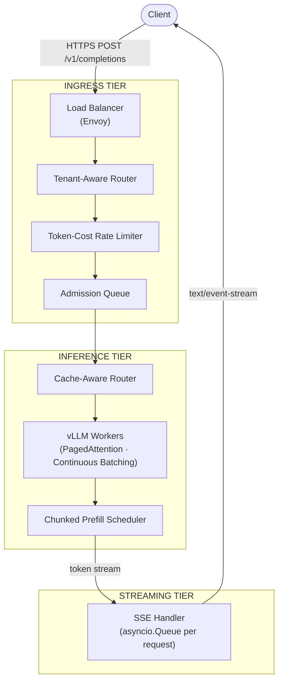

# Fastino Labs — LLM Inference System Design

> **Submission for:** Fastino Labs Take-Home Assignment  
> **Design notebook (architecture, sizing math, trade-offs):** [Colab](https://colab.research.google.com/drive/1SHAw2Oug7p_oBmxegJlV5Ca3O9sKPGQm?usp=sharing)  
> **C4 diagram:** [IcePanel](https://s.icepanel.io/X7127RWouBNohc/BKOL)

---

## Assumptions

| Parameter | Value | Notes |
|-----------|-------|-------|
| Model | 13B parameters, fp16 | Given |
| GPU (production) | NVIDIA H100 80GB SXM | Industry standard for this scale |
| Model weight footprint | ~26 GB | 13B × 2 bytes |
| KV cache per request | ~560 MB | 700 tokens × 0.8 MB/token |
| Concurrent requests per H100 | ~80 | 50 GB KV budget ÷ 560 MB, PagedAttention |
| Decode throughput per H100 | ~4,000 tok/s | Memory-bandwidth bound (~50% of H100 ceiling) |
| Requests in flight (steady state) | ~375 | Little's Law: 5,000 RPS × 0.075 s |
| GPUs needed | ~8–10 | 375 in-flight ÷ 80 per GPU + burst headroom |
| Target SLA | P95 < 2 s | Given |
| Multi-tenant | Yes — token-bucket per tenant | Given |

---

## Architecture



See the [Colab notebook](https://colab.research.google.com/drive/1SHAw2Oug7p_oBmxegJlV5Ca3O9sKPGQm?usp=sharing) for component decisions, sizing math, and trade-off analysis.

---

## Local Demo

Runs `MockEngine` on CPU — no GPU required. Illustrates the full flow: rate limit → admission → worker → SSE stream.

```bash
make install   # pip install fastapi uvicorn pydantic
make demo      # 5 requests, concurrency 5
make sim       # 20 requests, concurrency 5
```

---

## Repository Structure

```
src/
├── gateway/
│   ├── router.py        ← Cache-affinity routing (SHA256 prefix hash)
│   ├── rate_limiter.py  ← Token-bucket per tenant (tokens/s, not RPS)
│   └── admission.py     ← asyncio.PriorityQueue burst buffer
├── inference/
│   ├── engine.py        ← MockEngine (local) + VLLMEngine (prod)
│   ├── worker.py        ← Continuous-batching wrapper
│   └── scheduler.py     ← Chunked-prefill scheduler stub
└── streaming/
    └── sse.py           ← SSE handler (asyncio.Queue per request)
sim/
└── load_sim.py          ← Local load generator
```
